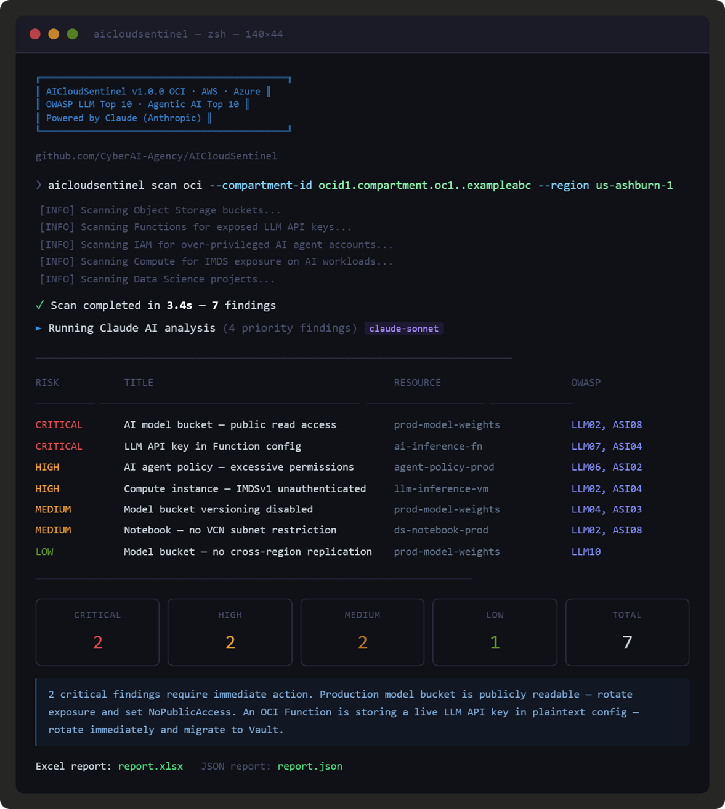
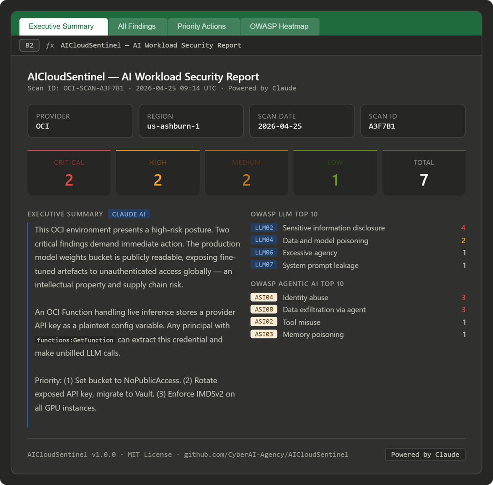
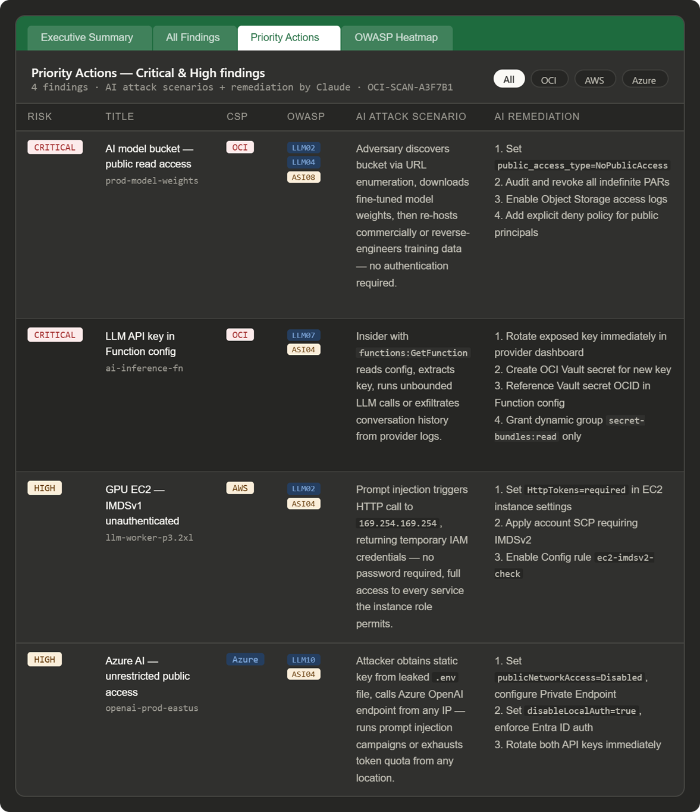

# AICloudSentinel 🛡️🤖

> **AI Workload Security Scanner for Cloud Infrastructure**
> Detect misconfigurations in AI/LLM deployments across OCI, AWS, and Azure.
> Powered by Claude. Mapped to OWASP LLM Top 10 and OWASP Agentic AI Top 10 (2026).

[](https://www.python.org/)
[](LICENSE)
[](https://owasp.org/www-project-top-10-for-large-language-model-applications/)
[](https://owasp.org/www-project-top-10-for-agentic-ai/)
[-blueviolet)](https://anthropic.com)

---

## Screenshots

**CLI scan output — live findings with severity and OWASP mapping:**


**Excel Executive Summary — risk KPIs and Claude-generated narrative:**


**Priority Actions sheet — AI attack scenarios and step-by-step remediation:**


---

## The Problem

Generic CSPM tools scan your cloud for misconfigurations — but they were built before AI workloads existed. They have no concept of:

- A publicly exposed S3 bucket holding fine-tuned model weights
- An OCI Function storing an OpenAI API key as a plain-text config variable
- An EC2 GPU instance running LLM inference with IMDSv1 enabled (SSRF-to-credential-theft)
- An Azure AI Services account reachable from any IP with static key auth
- An IAM role granting an AI agent `bedrock:*` or `manage all-resources`

**AICloudSentinel fills that gap.** It scans the AI/LLM layer of your cloud infrastructure — the model storage, inference endpoints, agent service accounts, and LLM API credentials — and explains each finding using Claude.

---

## What It Does

| Check Category | OCI | AWS | Azure |
|---|:---:|:---:|:---:|
| AI model storage bucket — public access | ✅ | ✅ | ✅ |
| AI model storage — versioning disabled (poisoning risk) | ✅ | ✅ | — |
| LLM API key in serverless function config (plaintext) | ✅ | ✅ | ✅ |
| Agent IAM / service account over-privilege | ✅ | ✅ | — |
| Compute IMDS v1 on AI/GPU workloads | ✅ | ✅ | — |
| ML notebook / workspace public network access | ✅ | ✅ | ✅ |
| LLM endpoint (Bedrock / Cognitive Services) without auth | — | ✅ | ✅ |
| Bedrock model invocation logging disabled | — | ✅ | — |
| Azure AI Services using static keys (no Entra ID) | — | — | ✅ |
| Key Vault soft-delete disabled for AI secret stores | — | — | ✅ |

Every finding is mapped to:
- **OWASP Top 10 for LLM Applications 2025** (LLM01–LLM10)
- **OWASP Top 10 for Agentic Applications 2026** (ASI01–ASI10)

---

## Claude-Powered AI Analysis

When `ANTHROPIC_API_KEY` is set, AICloudSentinel sends each finding to Claude for:

1. **Attack scenario** — "What could an attacker actually do with this misconfiguration?"
2. **Remediation steps** — Context-aware, provider-specific fix instructions
3. **Executive summary** — A narrative report suitable for CISOs and security leads
4. **Risk narrative** — 2-sentence posture summary for dashboards

This is not a chatbot wrapper. It's a structured analysis pipeline that feeds finding context (resource type, cloud provider, evidence, OWASP mappings) to Claude and parses structured JSON back.

---

## Quick Start

### Install

```bash
# Install with all cloud providers
pip install aicloudsentinel[all]

# Or install for specific providers
pip install aicloudsentinel[oci]
pip install aicloudsentinel[aws]
pip install aicloudsentinel[azure]
```

### Configure credentials

```bash
# OCI: standard ~/.oci/config
# AWS: standard ~/.aws/credentials or environment variables
# Azure: az login or set AZURE_CLIENT_ID / AZURE_TENANT_ID / AZURE_CLIENT_SECRET

# Claude AI analysis (optional but recommended)
export ANTHROPIC_API_KEY=your-key-here
```

### Run a scan

```bash
# OCI scan with AI analysis
aicloudsentinel scan oci \
  --compartment-id ocid1.compartment.oc1..examplexxxxxxx \
  --region us-ashburn-1 \
  --output report.xlsx

# AWS scan
aicloudsentinel scan aws \
  --region us-east-1 \
  --output aws_report.xlsx

# Azure scan
aicloudsentinel scan azure \
  --subscription-id xxxxxxxx-xxxx-xxxx-xxxx-xxxxxxxxxxxx \
  --output azure_report.xlsx

# Skip AI enrichment (no API key needed)
aicloudsentinel scan oci \
  --compartment-id ocid1.compartment.oc1..examplexxxxxxx \
  --no-ai
```

### Use as a Python library

```python
from aicloudsentinel.scanners.oci_scanner import OCIScanner
from aicloudsentinel.analyzers.claude_analyzer import ClaudeAnalyzer
from aicloudsentinel.reporters.excel_reporter import ExcelReporter

# Scan
scanner = OCIScanner(compartment_id="ocid1.compartment.oc1..example")
result  = scanner.scan()

# Enrich with Claude
analyzer = ClaudeAnalyzer()
result   = analyzer.analyze(result)

# Report
ExcelReporter().write(result, "report.xlsx")

print(f"Critical: {result.critical_count}")
print(f"High:     {result.high_count}")
print(result.executive_summary)
```

---

## Output

### Terminal
```
  RISK       TITLE                                                RESOURCE                       OWASP
  ────────── ──────────────────────────────────────────────────── ────────────────────────────── ────────────────────
  CRITICAL   AI model bucket has public read access               prod-model-weights             LLM02, LLM04, ASI08
  CRITICAL   LLM API key exposed in OCI Function config           ai-inference-fn                LLM02, LLM07, ASI04
  HIGH       AI compute instance has unauthenticated IMDS v1      llm-inference-vm               LLM02, ASI04
  HIGH       AI agent policy grants excessive cloud permissions   agent-policy-prod              LLM06, ASI02
  MEDIUM     AI model bucket versioning disabled                  prod-model-weights             LLM04, ASI03
```

### Excel Report (4 sheets)
- **Executive Summary** — risk KPIs, Claude-generated narrative, scan metadata
- **All Findings** — full sortable table with OWASP mappings and AI analysis
- **Priority Actions** — CRITICAL + HIGH only with step-by-step remediation
- **OWASP Heatmap** — finding counts mapped to both OWASP frameworks

### JSON (for CI/CD / SIEM)
```json
{
  "scan_id": "OCI-SCAN-A3B7F1",
  "provider": "OCI",
  "summary": { "total": 7, "critical": 2, "high": 2, "medium": 3, "low": 0 },
  "executive_summary": "...",
  "findings": [...]
}
```

---

## CI/CD Integration

```yaml
# .github/workflows/ai-security.yml
- name: AICloudSentinel Scan
  run: |
    pip install aicloudsentinel[aws]
    aicloudsentinel scan aws --region us-east-1 --json --output report.json
  env:
    ANTHROPIC_API_KEY: ${{ secrets.ANTHROPIC_API_KEY }}
    AWS_ACCESS_KEY_ID: ${{ secrets.AWS_ACCESS_KEY_ID }}
    AWS_SECRET_ACCESS_KEY: ${{ secrets.AWS_SECRET_ACCESS_KEY }}
```

Exit codes: `0` = clean / low-medium only | `1` = high findings | `2` = critical findings

---

## OWASP Framework Coverage

### LLM Top 10 (2025)
| ID | Category | Covered By |
|---|---|---|
| LLM01 | Prompt Injection | IMDS checks, public endpoint checks |
| LLM02 | Sensitive Information Disclosure | API key exposure, public bucket, IMDS |
| LLM04 | Data and Model Poisoning | Versioning checks, public write access |
| LLM06 | Excessive Agency | IAM over-privilege checks |
| LLM07 | System Prompt Leakage | API key in function config checks |
| LLM10 | Unbounded Consumption | Replication, logging, access controls |

### Agentic AI Top 10 (2026)
| ID | Category | Covered By |
|---|---|---|
| ASI02 | Tool Misuse | IAM over-privilege on agent accounts |
| ASI03 | Memory Poisoning | Storage versioning checks |
| ASI04 | Identity Abuse | IMDS, API key exposure, managed identity checks |
| ASI08 | Data Exfiltration via Agent | Public bucket, direct internet, network controls |
| ASI09 | Rogue or Compromised Agent | Logging checks |

---

## Required Permissions

### OCI (minimum)
```hcl
Allow group AICloudSentinelAuditors to read object-family in compartment <n>
Allow group AICloudSentinelAuditors to read functions-family in compartment <n>
Allow group AICloudSentinelAuditors to read policies in compartment <n>
Allow group AICloudSentinelAuditors to read instances in compartment <n>
Allow group AICloudSentinelAuditors to read data-science-family in compartment <n>
```

### AWS (minimum)
```json
{
  "Effect": "Allow",
  "Action": [
    "s3:ListAllMyBuckets", "s3:GetBucketPublicAccessBlock",
    "s3:GetBucketVersioning", "lambda:ListFunctions",
    "iam:ListRoles", "iam:ListAttachedRolePolicies",
    "ec2:DescribeInstances", "sagemaker:ListNotebookInstances",
    "bedrock:GetModelInvocationLoggingConfiguration"
  ],
  "Resource": "*"
}
```

### Azure (minimum)
`Reader` role on the subscription.

---

## Roadmap

- [ ] GCP support (Vertex AI, Cloud Functions, Cloud Storage)
- [ ] Terraform / IaC scanning (detect misconfigs before deployment)
- [ ] GitHub Actions SARIF output
- [ ] Slack / Teams alert integration
- [ ] Docker image for containerised scans
- [ ] Custom finding rules via YAML
- [ ] RAG-enhanced analysis using your own security runbooks

---

## Contributing

Contributions welcome — new cloud provider scanners, additional checks, and integrations especially needed.

1. Fork the repo
2. Create a branch: `git checkout -b feat/gcp-scanner`
3. Add tests for new checks
4. Open a PR with a clear description of what the check detects and why it matters for AI workloads

---

## About

Built by [Venkata Sai Geetham](https://github.com/nvsaigeetham) under the [SpecterBreach](https://github.com/SpecterBreach) organisation.

*"Offensive Intelligence. Defensive Automation."*

## License

[MIT](LICENSE)
